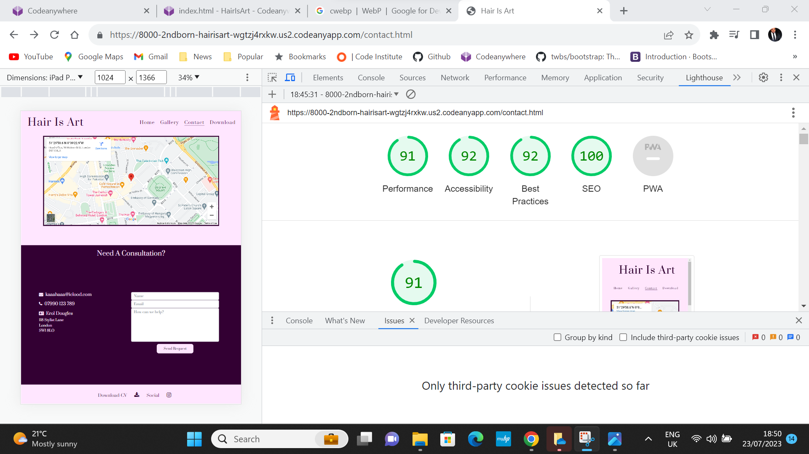

# Hair Is Art

## Project Goals

The goal of the Hair is Art website is to showcase the talents and abilities of Kara Francis to attract the attention of prospective employers who are in need of her services.

## User Stories

-	I would like to have an appealing home page with an inviting and relevant picture.

-	I would like to learn about the owners skills and experience.

-	I would like to read testimonials from previous clients.

-	I would like to see a gallery showcasing the owners work.

-	When I hover over a gallery picture I would like to be able to see an enlarged version of the picture.

-	I would like to know what services the owner provides.

-	I would like have options that tell me how I can contact the owner.

-	I would like to downloadable the owners CV.

-	I would like a links to the owners social media page via icons.

-	I would like to be able to find to navigate key areas of interest (Home, About Me, Gallery, Contact and download pages).

-	I would like to access the webite using my mobile, tablet and desktop computer.

## Features

### Page consistency

- Each page has the “Hair Is Art” text header in the top right corner of the page. Clicking on the text transfers the user to the top of the home page.

- Tablet users will view the header “Hair Is Art” in the top right corner of the page. Clicking on the text transfers the user to the top of the home page.

- Mobile users will view the header “Hair Is Art” in the centre of the page. Clicking on the text transfers the user to the top of the home page.

- ####  Navigation Bar

	-	Each page will have a navigation bar containing 4 options Home, Gallery, Contact and Download.

	-	Clicking on “Gallery” will transport the user to the Gallery section of the website.

	-	Clicking on ”Contact” will transport the user to the Contact section of the website.

	-	Clicking on “Download” will open a new tab that will display a downloadable copy of the owner’s CV.

- #### Footer

	-	Each page will have a “Download CV” icon in the footer.

	-	Each page will have an Instagram icon that when clicked takes the user to an Instagram page.

- #### Home Page

	-	Hero image will show a picture of a woman with her hair done looking fabulous.

- #### About me

	- The about me section will sit on top of the hero image taking the bottom third of the image. The background will be opaque and contain a few lines of text about the owner. This will be consist on mobile and tablet platforms.

- #### Skills & Services

	-	6 tiles with 6 pictures related to the text about the service in the centre.

	-	The tiles formation will be 3 columns and 2 rows.

	-	The tiles will be titled Cutting, Colour, Styling, TV & Film, Events and Education.

	-	Tablet users will view the formation of the tiles as 2 columns and 3 rows.

	-	Mobile users will view the formation of the tiles as 1 column consisting of 6 tiles.

-	#### Testimonials

	-	Testimonials from 3 previous clients will be available for users to read.

	- Users will be able to view 2 testimonials on the tablet, positioned horizontally.

	-	Users will be able to view 2 testimonials on the mobile, positioned vertically.

- #### Gallery Page

	-	Users can view 8 pictures of the owner’s greatest works that will be showcased as tiles.

	-	Users can view the formation of the tiles as 4 columns and 2 rows.

	-	Tablet users can view gallery pictures as 2 columns consisting of 8 pictures.

	- Mobile users can view gallery pictures as 1 column consisting of 8 pictures.

- #### Contact Page

	- Google maps page highlighting where the owner is located at the top of the page, underneath the header.

	-	Owner’s email address, mobile phone and address are located on the bottom left of the page.

	- Users can contact the owner via the website by completing a form titled “Need a consultation?”

	- User are required to enter their Name, Email and a brief description of the service that they are interested in.

	- The form sections are labelled with “Name”, “Email” and “Please tell me how I can help” pseudo prompts to help the user.

	- Once users have completed the form the button below the form will change colour.

	- If user enter the wrong information, they will be prompted to enter the correct information. e.g. the correct email format.

	- Tablet users will view the “consultation form” with 50% width of the screen and the button will increase in size. Email, phone and address details will be positioned above with the email and phone taking ½ the width of the screen, while the address occupies the remaining ½.

	- Mobile users will view the “consultation form” with 100% width of the screen and the button will increase in size. Email, phone and address details will be positioned horizontally one after the other.

## Developer and Business Goals

- To create an interest for potential clients in need of the services that Hair is Art is offering.

- To provide an intuitive and interactive platform for potential clients to learning more about the owners skills and experience.

- To provides clients with a way to make further contact with the owner should they want to discuss a way forward.

## Future Features

- When users complete the contact form the owner will receive notification via email.

- How to video tutorials and major events will be added to the website to add to the user’s experience.

- Users will be able to view and increased number of gallery pictures.

- Hovering over any tiles will reveal a boarder that will prompt the user to click for more information or expansion.

- Clicking on the services tile will expand the picture, displaying some text about the service and have a contact button, that is a link to the contact page.

- Clicking on a gallery tile will expand the picture, show user can view pics in more detail.

- Clicking on the Instagram icon will link the user to the owners Instagram page.

## Typography and Colour

- The primary font for this project will be Prata, which reflects a sense of elegant that the users will appreciate.

- #ffe6ff will be used on the Header, Skills & Service and Footer sections. This a colour present on the owners Instagram account. The font on the About Me section.

- #330033 will be used on the Navigation, Title and Footer fonts. The background of the Gallery page and the Contact page “Need a Consultation” section.

White will be used on the Testimonial section of the Home page.

## Wireframes

## Technology

- Codeanywhere - to write and develop the code.

- GitHub - for hosting the website

- Balsamiq - for creating the wireframe

- Font Awesome - for the icons

- Google fonts - using the fonts for the website

- Bootstrap - creating the form and buttons.

- w3schools[lightbox slideshow](https://www.w3schools.com/howto/howto_js_lightbox.asp)

## Testing

- ### Code validation

	-	**CSS**

	

	- **HTML**

		-	Home Page - The validator spotted an error with the “learn-more” button, explaining that the a element shouldn’t be a descendant of the button element. I retified this by forming and styling a button using the anchor tag. There were not further areas of concern.

		

		- Gallery - The Gallery section returned only warnings and infomation. 
  
  		

		- Contact - The validator spotted an error with the “Send Request” button, explaining that the a element shouldn’t be a descendant of the button element. I retified this by forming and styling a button using the anchor tag. The validator also took issue with the Google Maps iframe width and height. After numerous tests on all plaforms I did see a problem with the maps responsiveness. 

		

		-	Confirmation.html

		There were not areas of concern on this section.

		-	**Lighthouse**

			- Home page
Performance is 67, which is ok but could be better. This is because the format of the pictures are jpeg which is slowing down the performance.
Accessibility is 96
Best practice is 100
SEO is 89

			- Gallery
   
Performance is 68, which similar to the home page. This is because of the number of pictures to be displayed. Coverting to jpeg2000 would be the best option.
Accessibility is 96
Best practice is 100
SEO is 90

			- Contact
Performance is 91
Accessibility is 96
Best practice is 100
SEO is 89

### Test cases

**User Stories Test Case**

- **Home Page**
	
	- When the user enters the Home page, they will she an inviting hero imagine that shoes the logo “Hair Is Art” and the navigation bar that shows the 4 options Home, Gallery, Contact and Download. The navigation bar is a consistent feature across all the pages on the website. Clicking on the logo takes the user back to the home page or refreshes the page if your already on the home page. Hero image was taken and provided by Kara Francis.

	

	-	Scrolling further down the page the user will see more of the hero imagine coupled with the “About Me” section which in on an opaque background with an introductory bio in white writing. The There is also a white button that invites the user to learn more about the owner of the site.

	

	-	Hovering over the learn more button changes the colour to alert the user that the button is interactive. Clicking on the button creates a new tab where the user can read a bio of the owner. Bio was provided by Kara Francis

	

	

	-	Scrolling further down the page the user will come to the “Skills & Services” page. There are six panels that show the services that are provided by the owner. Hovering over each panel highlights them. In the future the user will be able to learn more about those services. Images for Cutting, Colour and styling were all provide by “Keune Cosmetic”. TV & film is from [https://juvale.com/products/b07bs7rq4m](https://juvale.com/products/b07bs7rq4m) and Events and Education were taken and provided by Kara Francis.

	

	-	The final section is the “Testimonials” where the user can read endorsements from satisfied customers. To add value to the testimonial’s quotation marks and 5 yellow stars validate the comments. All testimonials are real customers and have been provided by Kara Francis.

	

	-	At the bottom of the page the user will see “Download-CV” with a download icon and “Social” with an Instagram icon. This feature is consistent amongst the pages of the website. Clicking on the download icon opens a new tab where the user can view the owners CV. CV was supplied by Kara Francis

	

	-	Clicking on the Instagram Icon opens a tab to Instagram.

	

- **Gallery**

	-	The user will see the logo and navigation bar. There is a line under “Gallery” to show the user what page they are on. There are eight panels placed on top of a purple background. On the panels are images that showcase the owner’s best works. All pictures/videos were taken and supplied by Kara Francis. [https://www.w3schools.com/howto/howto_js_lightbox.asp](https://www.w3schools.com/howto/howto_js_lightbox.asp) was used to create the slideshow pop up.

	

	-	If the user clicks on anyone of the panel, it will trigger a pop-up slideshow so the user can view the pictures in a larger format.

	

	-	The slideshow has arrows either side of the picture to encourage the user to view another picture. Underneath each picture is a caption highlighting the colour of the hair.

	

	-	Clicking on the left or right arrow will toggle the slide show and clicking on **"x"** on the right corner will close the slideshow. The user can track what slide they are on with the numbers on the left corner of each picture.

	

	-	Slide 7 has a video that the user play with or without sound.

	

	-	At the bottom of the page is the footer which is the same as the home page.

	

-	**Contact**

	-	The user will see the logo and navigation bar. There is a line under “Contact” to show the user what page they are on. The user will also see a Google map which shows where the owner can be found. I used the Google maps API to upload the map.

	

	- Scrolling further down the page poses a question to the user “Need A Consultation?” Below is the owner Email, Phone Number and Business address.

	

	-	Underneath the owners contain details the user will see a contact form to be completed by the user so they can set up a consultation or ask the owner a question. Beneath the form is the “Send Request” button. Bootstraps form control class for used for the form.

	

	-	The footer is the same as the other pages.
	
-	**Test Procedure**

	- Does the Logo refresh the page/take the use back the home page?

		-	*I clicked the “logo” and it refreshed the page.*
		-	*I clicked "Logo” on the Gallery and Contact page and it took me back to the Home page.*

	-	Does “Home” on the navigation bar refresh the page/ take me back to the Home page?

		-	*I clicked “Home” and it refreshed the page.*

		-	*I clicked "Home” on the Gallery and Contact page and it took me back to the Home page.*

	-	Does “Download” on the navigation bar open a new tab the displays the owners CV?

		-	*I clicked “Download” and it opened a new tab with the owners CV.*

	-	Does the “Learn More” button in the About Me section open a new tab that displays the owner’s bio?

		-	*I clicked on the “Learn More" button and it opened a new tab with the user’s bio and picture on it.*

	-	Do the Skills & Services panels highlight when hovered over?

		-	*I hovered over each panel, and they were highlighted with a purple boarder.*

	-	Does the “Download Icon” open a new tab with the owners CV?

		-	*I clicked on the “Download Icon” from the Home, Gallery and Contact and a new tab was opened with the owners CV.*

	-	Does the “Instagram Icon” open a new tab to the Instagram platform?

		*	*I clicked on the Instagram Icon from the Home, Gallery and Contact pages and a new tab was opened to the Instagram platform.*

	-	Does every panel in the Gallery trigger the pop up slide show?

		-	*I clicked on every panel in the Gallery, and they all trigger the slide starting with the panel I clicked on.*

	-	Does the “Close” icon close the slideshow?

		-	*I clicked the close button on every panel, and it closed the slideshow.*

	-	Do the left and right arrows on the slideshow toggle the next and previous pictures?

		-	*I clicked the left arrow 8 times, and it took me through every picture.*

		-	*I clicked on the right arrow 8 times, and it took me through every picture in the reverse direction.*

	-	Does the on slide 7 video play with sound?

		-	*I clicked on panel 7 and it plays a Tik Tok view of the panel red with the sound.*

	-	Can the sound on slide 7 be turned off?

		-	*I clicked on the sound icon on slide 7 and it muted the sound.*

	-	On the Contact page does the Google map zoom buttons zoom in and out?

		-	*I clicked on the “+” and it zoomed in.*

		-	*I clicked on the “-“and it zoomed out.*

	-	Does the “Contact Form” bring up a prompt if the user does not enter the correct format in the email section?

		-	*I tried to type “slfalksdfj” into the email bar and a prompt came up instructing me to “Please include an ‘@’ in the email address. ‘slfalksdfj’ is missing an ‘@’.*

	-	Does the send request button change colour when hovered over?

		-	*I hovered over the “Send Request” button and changed from pink to purple.*

	-	Does the “Send Request” button open a new tab that acknowledges the user’s submission?

		-	*I clicked the “Send Request” and a new tab was opened that said “Your Consultation Request Has Been Successfully Submitted!”*

	-	When Chrome developer tools are opened does the website work on tablet and mobile platforms?

		-	*The website worked on multiple screen sizes.*

**Supported screens & browers**

I used Google Chrome to develop and test my website.

I tested my website on the following screen sizes:

-	1024px

Home, Gallery, Slideshow and Contact pages.

- 912px

Home, Gallery, Slideshow and Contact pages.

- 820px

Home, Gallery, Slideshow and Contact pages.

-	768px

Home, Gallery, Slideshow and Contact pages.

From this point on the user will need to click on the Hamburger icon in order to access the menu. All the screenshots will show the menu after it has been toggled.

Screenshots of the menu before toggling:

-	540px

Home, Gallery, Slideshow and Contact pages.

-	430px

Home, Gallery, Slideshow and Contact pages.

-	414px

Home, Gallery, Slideshow and Contact pages.

-	390px

Home, Gallery, Slideshow and Contact pages.

- 360px

Home, Gallery, Slideshow and Contact pages.

- 280px

Home, Gallery, Slideshow and Contact pages.

all sections of the website function on all of the sizes listed.

### Fixed bugs

Media queries that I was adding were making permanent changes to the desktop. After doing some research I found that its was because I was using @media screen and (min-width: 768px). I changed this to @media and (min-width: 768px) and it worked.

## Deployment

### Github
I used Git hub to host my repository.

1. Go to [https://github.com/2ndborn/HairIsArt](https://github.com/2ndborn/HairIsArt)

2. Click on settings.

3. Scroll down and click on pages on the left-hand side.

4. Scroll down to Build and deployment.

5. Where it says “none” change to “main”.

6. Press “Save” to deploy to GitHub.

Githup pages
I used Github pages to deploy my website to a live website.
[Hair Is Art Web Address](https://2ndborn.github.io/HairIsArt/index.html)
